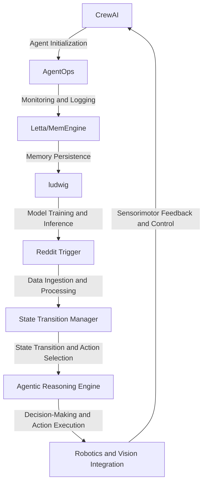

# Non-Stationary Stochastic Risk Engine for Scientific Research and Development
> Orchestrating Agentic Complexities for High-Stakes Research Endeavors

## 🏗️ Technical Architecture & Multi-Agent Flow
The technical architecture of this platform is centered around the symbiotic interaction of CrewAI, AgentOps, ludwig, and Reddit Trigger. The following Mermaid.js diagram illustrates the complex flow of state transitions, memory persistence, and tool calling:

This diagram highlights the intricate dance of agents, tools, and components that underpin the Non-Stationary Stochastic Risk Engine.

## 🔍 The Vertical Bottleneck: Stochastic Risk Management
The scientific research and development sector is plagued by the inherent uncertainty and risk associated with high-stakes experimentation and innovation. The inability to accurately predict and mitigate risks can lead to catastrophic failures, financial losses, and damage to reputation. The technical friction arises from the complexities of non-stationary stochastic processes, which defy traditional risk management approaches. The high-stakes mathematical and operational failures can have far-reaching consequences, including compromised research integrity, equipment damage, and even human harm.

The stochastic risk management bottleneck is further exacerbated by the lack of effective tools and methodologies for modeling, analyzing, and mitigating non-stationary stochastic risks. Traditional approaches often rely on simplistic assumptions, neglecting the intricate dynamics and interdependencies that characterize complex research systems. The consequences of this oversight can be severe, resulting in unforeseen failures, missed opportunities, and wasted resources.

The Non-Stationary Stochastic Risk Engine is designed to address this critical bottleneck by providing a robust, adaptive, and agile framework for managing stochastic risks in scientific research and development. By leveraging the power of agentic complexities, machine learning, and data-driven insights, this platform enables researchers and practitioners to navigate the uncertain landscape of high-stakes research with greater confidence and precision.

## 💡 The Solution: Agentic Risk Management
The Non-Stationary Stochastic Risk Engine orchestrates CrewAI, AgentOps, ludwig, and Reddit Trigger to create a comprehensive risk management framework. The platform's agentic reasoning engine utilizes CrewAI's role-based autonomous teams to model and analyze complex research systems, identifying potential risks and vulnerabilities. AgentOps provides real-time monitoring and logging, enabling the platform to adapt to changing conditions and respond to emerging risks.

The ludwig machine learning framework is used to develop and train predictive models that forecast risk probabilities and consequences. These models are informed by data ingested from various sources, including Reddit Trigger, which provides real-time feedback and insights from the research community. The platform's memory persistence mechanism, powered by Letta/MemEngine, ensures that critical information and knowledge are retained and reused across multiple research iterations.

## 🧩 Agentic Stack Deep-Dive
The technical justification for each library and integration is rooted in the specific requirements of the Non-Stationary Stochastic Risk Engine. CrewAI is chosen for its role-based autonomous teams, which enable the platform to model and analyze complex research systems. AgentOps is selected for its real-time monitoring and logging capabilities, providing the platform with the agility and adaptability needed to respond to emerging risks.

Ludwig is used for its machine learning capabilities, which enable the platform to develop and train predictive models that forecast risk probabilities and consequences. Reddit Trigger is integrated to provide real-time feedback and insights from the research community, informing the platform's predictive models and risk management strategies.

The interlocking of CrewAI, AgentOps, and ludwig is facilitated by the platform's agentic reasoning engine, which orchestrates the interactions between these components. The engine's decision-making processes are informed by the predictive models developed by ludwig, which are in turn refined by the real-time feedback and insights provided by Reddit Trigger.

## ✨ Capabilities & Features
The Non-Stationary Stochastic Risk Engine offers the following capabilities and features:
* **Agentic Risk Management**: A comprehensive framework for modeling, analyzing, and mitigating non-stationary stochastic risks in scientific research and development.
* **Role-Based Autonomous Teams**: CrewAI's role-based autonomous teams enable the platform to model and analyze complex research systems, identifying potential risks and vulnerabilities.
* **Real-Time Monitoring and Logging**: AgentOps provides real-time monitoring and logging, enabling the platform to adapt to changing conditions and respond to emerging risks.
* **Predictive Modeling**: Ludwig's machine learning framework is used to develop and train predictive models that forecast risk probabilities and consequences.
* **Real-Time Feedback and Insights**: Reddit Trigger provides real-time feedback and insights from the research community, informing the platform's predictive models and risk management strategies.
* **Memory Persistence**: The platform's memory persistence mechanism, powered by Letta/MemEngine, ensures that critical information and knowledge are retained and reused across multiple research iterations.
* **Agentic Reasoning Engine**: The platform's agentic reasoning engine orchestrates the interactions between CrewAI, AgentOps, ludwig, and Reddit Trigger, enabling the platform to make informed decisions and take effective actions.
* **Robotics and Vision Integration**: The platform's robotics and vision integration enables the platform to interact with and control physical systems, facilitating the execution of research experiments and protocols.
* **Sensorimotor Feedback and Control**: The platform's sensorimotor feedback and control mechanisms enable the platform to receive and respond to feedback from physical systems, ensuring precise control and execution of research experiments and protocols.
* **Data Ingestion and Processing**: The platform's data ingestion and processing capabilities enable the platform to collect, process, and analyze large datasets, informing the platform's predictive models and risk management strategies.

## 🛠️ Technical Implementation
The code organization and method calls are designed to facilitate the interactions between CrewAI, AgentOps, ludwig, and Reddit Trigger. The platform's agentic reasoning engine is implemented using a modular architecture, enabling the platform to adapt to changing conditions and respond to emerging risks.

The platform's memory persistence mechanism is implemented using Letta/MemEngine, ensuring that critical information and knowledge are retained and reused across multiple research iterations. The platform's predictive modeling capabilities are implemented using Ludwig's machine learning framework, enabling the platform to develop and train predictive models that forecast risk probabilities and consequences.

## 📊 Business Impact & ROI
The Non-Stationary Stochastic Risk Engine has the potential to significantly impact the scientific research and development sector by providing a robust, adaptive, and agile framework for managing stochastic risks. By leveraging the power of agentic complexities, machine learning, and data-driven insights, this platform enables researchers and practitioners to navigate the uncertain landscape of high-stakes research with greater confidence and precision.

The platform's capabilities and features can help reduce the risk of unforeseen failures, missed opportunities, and wasted resources, resulting in significant cost savings and improved research outcomes. The platform's agentic reasoning engine and predictive modeling capabilities can also facilitate the identification of new research opportunities and the development of innovative solutions, leading to increased revenue and competitiveness.

## 🚀 Getting Started
```bash
git clone https://github.com/arvind-sundararajan/scientific-research-agentic-complexities.git
cd scientific-research-agentic-complexities
pip install -r requirements.txt
python src/main.py
```

## 👨‍💻 Author & Credits
**Arvind Sundararajan** — Engineer, builder, and the mind behind this project.
🌐 [LinkedIn](https://www.linkedin.com/in/arvind-sundara-rajan/) | Chennai, India

---
### 🙏 Acknowledgements
- The open-source community
- The Scientific Research and Development practitioners who inspired this design